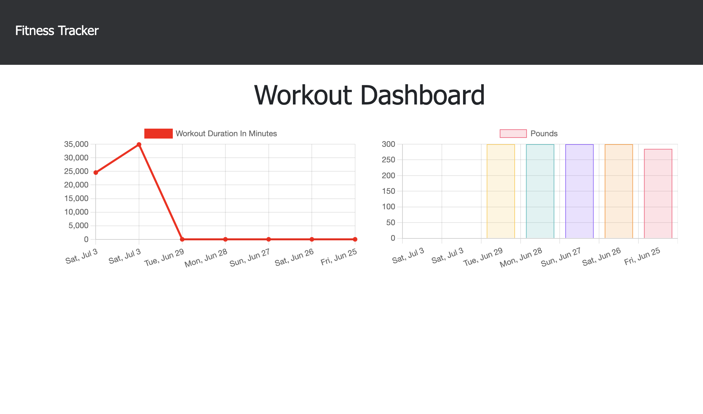

# Workout Tracker

This app is a Mongo database with a Mongoose schema and handle routes with Express.

## User Story

- As a user, I want to be able to view create and track daily workouts. I want to be able to log multiple exercises in a workout on a given day. I should also be able to track the name, type, weight, sets, reps, and duration of exercise. If the exercise is a cardio exercise, I should be able to track my distance traveled.

The user can:

- Add exercises to the most recent workout plan.

- Add new exercises to a new workout plan.

- View the combined weight of multiple exercises from the past seven workouts on the `stats` page.

- View the total duration of each workout from the past seven workouts on the `stats` page.

## Links

[Deployed Link](https://nameless-earth-51895.herokuapp.com/)

[Github Repo](https://github.com/MatteoThomas/workout-tracker)

[Video Walkthrough](https://drive.google.com/file/d/1ycGnB6HJubHDIP50NvxSlSp9fQo0CAof/view)

## Contributor

Matthew Elliott

[Email](mailto:matt.ell@pm.me)

[Github](https://github.com/MatteoThomas/)

[LinkedIn](https://www.linkedin.com/in/matthewell/)
